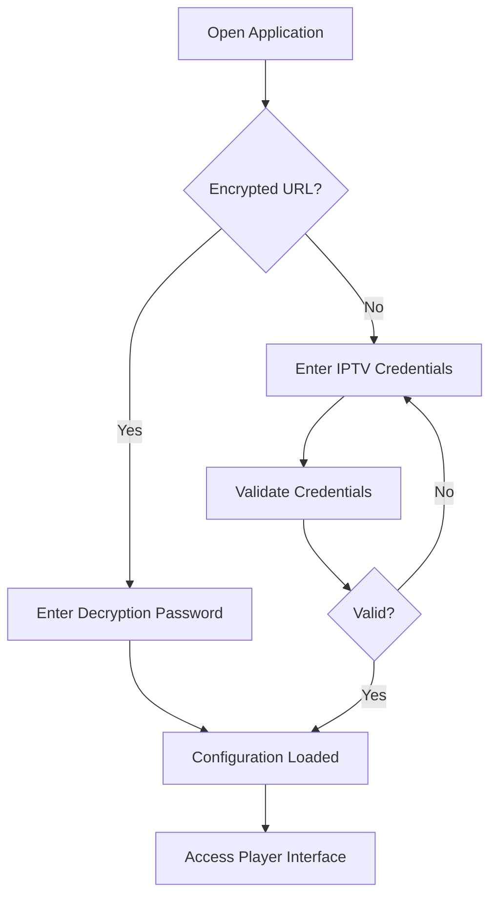
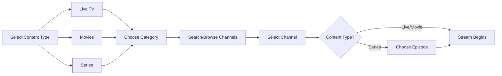
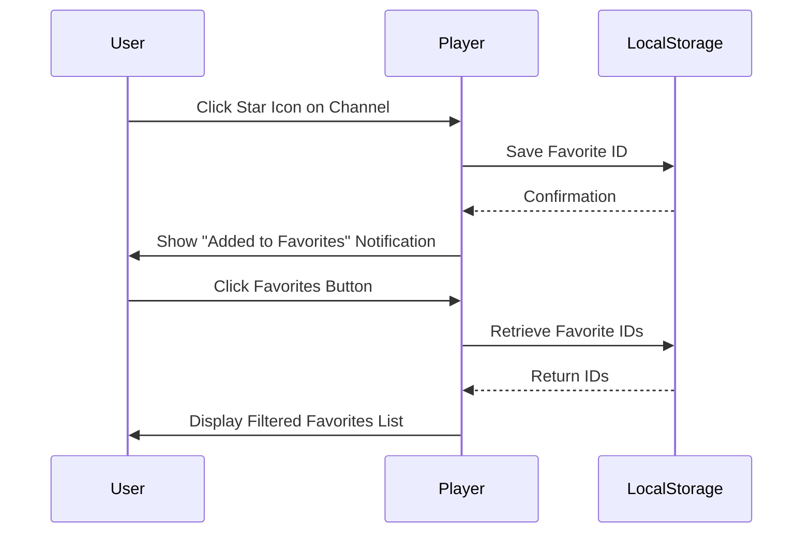
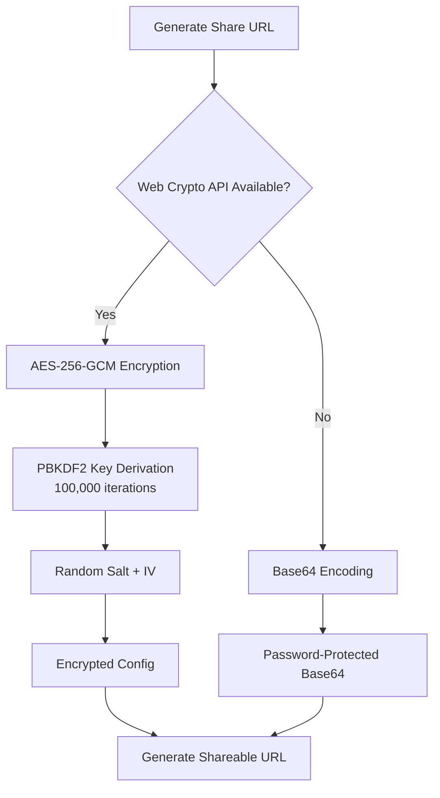

# xsukax IPTV Player

A lightweight, secure, and privacy-focused IPTV player that runs entirely in your browser. Stream live TV, movies, and series from your IPTV provider with zero server-side processing—your credentials never leave your device.

🌐 **Demo**: [http://iptv.xsukax.net](http://iptv.xsukax.net)

> **Note**: The demo uses HTTP (not HTTPS) to ensure compatibility with HTTP-based IPTV servers, as HTTPS pages cannot connect to insecure HTTP endpoints due to mixed content restrictions.

## 🎯 Project Overview

xsukax IPTV Player is a lightweight, single-file HTML application that enables users to stream IPTV content directly in their web browser without requiring server-side infrastructure or installation. The application interfaces with Xtream Codes API compatible IPTV services, providing an intuitive user experience for managing and consuming live television, video-on-demand content, and episodic series.

Built with vanilla JavaScript and leveraging HLS.js for adaptive streaming, this player emphasizes performance, security, and user privacy while maintaining broad compatibility with modern web browsers.

## 🔒 Security and Privacy Benefits

### End-to-End Encryption for Configuration Sharing
- **AES-256-GCM Encryption**: When supported by the browser (via Web Crypto API), all shared configurations are encrypted using industry-standard AES-256-GCM with PBKDF2 key derivation (100,000 iterations), ensuring credentials remain secure during transit and storage
- **Base64 Encoding Fallback**: For browsers lacking Web Crypto API support, configurations are Base64-encoded with password protection, providing a basic security layer while maintaining functionality across all platforms
- **Password-Protected Shares**: All shareable configuration URLs require a separate password for decryption, preventing unauthorized access even if the URL is intercepted

### Client-Side Architecture
- **No Server Storage**: All authentication and streaming operations occur directly between the user's browser and their IPTV provider, eliminating intermediary data collection
- **Zero Data Retention**: The application does not log, store, or transmit user credentials or viewing habits to any third-party servers
- **Local-Only Persistence**: Favorites are stored exclusively in the browser's localStorage, remaining under complete user control

### Secure Credential Handling
- **Memory-Only Sessions**: Credentials are held in memory during active sessions and cleared upon logout
- **No Automatic Persistence**: Login credentials are never saved to disk or localStorage without explicit user action (via encrypted sharing)
- **URL Parameter Cleanup**: After loading encrypted configurations, sensitive URL parameters are automatically removed from browser history

### Privacy-First Design
- **Direct Streaming**: Video content streams directly from IPTV providers to the user's browser without proxy servers
- **Minimal Footprint**: Single-file architecture with no external dependencies beyond HLS.js and standard browser APIs
- **Transparent Operation**: Open-source codebase allows full security auditing by the community

## ✨ Features and Advantages

### Core Functionality
- **Multi-Content Support**: Seamlessly switch between Live TV, Movies, and Series with dedicated interfaces for each content type
- **Advanced Search**: Real-time search across all channels with instant results and match highlighting
- **Category Filtering**: Organize content by categories provided by your IPTV service for efficient browsing
- **Favorites Management**: Star your preferred channels for quick access across sessions
- **Episode Browser**: Navigate series content with organized season and episode listings

### Streaming Capabilities
- **HLS Adaptive Streaming**: Automatic quality adjustment based on network conditions using HLS.js
- **Multiple Format Support**: Handles M3U8 streams for live content and direct MP4/MKV playback for VOD
- **Low Latency Mode**: Optimized HLS configuration for reduced buffering and improved responsiveness
- **Progressive Loading**: Pagination system loads content incrementally, ensuring fast initial page loads even with extensive channel lists

### User Experience
- **Clean Modern UI**: GitHub-inspired design with intuitive navigation and responsive layout
- **Real-Time Notifications**: Contextual feedback for all operations (success, error, warning, info)
- **Subscription Status Display**: Visual indicators showing account expiry dates with color-coded urgency (lifetime, active, expiring soon, expired)
- **Skeleton Loading**: Smooth placeholder animations during content fetching
- **Mobile Responsive**: Adaptive layout optimized for desktop and mobile viewing

### Technical Advantages
- **Zero Installation**: Runs entirely in the browser with no plugins or extensions required
- **Offline Capable**: Can be saved locally and used as a file:// URL without web hosting
- **Caching System**: Intelligent category and channel caching reduces redundant API calls
- **Cross-Browser Compatibility**: Works on Chrome, Edge, and other Chromium-based browsers
- **Lightweight**: Single 50KB HTML file with minimal resource consumption

## 📦 Installation Instructions

### Option 1: Web Hosting (Recommended)
1. Download the `index.html` file from this repository
2. Upload to any web server or hosting provider
3. Access via your domain (e.g., `http://yourdomain.com/index.html`)
4. **Important**: Use HTTP protocol if your IPTV server uses HTTP to avoid mixed content issues

### Option 2: GitHub Pages Deployment
1. Fork this repository
2. Navigate to **Settings** → **Pages**
3. Select **Deploy from a branch** → Choose `main` branch → `/ (root)` folder
4. Click **Save**
5. Access your player at `https://yourusername.github.io/xsukax-IPTV-Player/`
6. **Note**: GitHub Pages uses HTTPS, which may prevent connections to HTTP IPTV servers

### Option 3: Local File Usage
1. Download `index.html` to your computer
2. Open directly in Chrome or Edge browser (File → Open or double-click)
3. No web server required; functions perfectly as a local file
4. Shareable URLs generated in file mode will reference the local file path

### Option 4: Quick Start via Demo
Simply visit [http://iptv.xsukax.net](http://iptv.xsukax.net) to use the application immediately without any installation.

## 🚀 Usage Guide

### Initial Setup

#### Connecting to Your IPTV Service
1. **Manual Login**:
   - Enter your IPTV server URL (e.g., `http://example.com:8080`)
   - Provide your username and password
   - Click **Connect** to authenticate

2. **Via Shared Configuration**:
   - Open a shared URL (format: `http://iptv.xsukax.net?config=ENCRYPTED_DATA`)
   - Enter the password provided by the person who shared the configuration
   - Click **Decrypt** to load credentials and favorites

### Navigation Workflow

#### Browsing Content
1. **Switch Content Types**: Use the top navigation tabs (📺 Live TV | 🎬 Movies | 📺 Series)
2. **Filter by Category**: Select from the category dropdown to narrow results
3. **Search**: Type in the search box to find channels across all categories
4. **Load More**: Scroll down or click "Load More" to view additional channels (50 per page)

#### Playing Content
- **Live TV & Movies**: Click any channel to begin streaming immediately
- **Series**: Click a series → Select season and episode from the modal → Stream begins
- **Video Controls**: Use standard HTML5 player controls (play, pause, volume, fullscreen)

### Managing Favorites

- **Add Favorite**: Click the ☆ star icon on any channel card (turns gold ★)
- **Remove Favorite**: Click the ★ gold star icon to unfavorite
- **View All Favorites**: Click the **Favorites** button in the header to see your starred channels
- **Persistence**: Favorites are stored locally and persist across sessions

### Sharing Your Configuration

#### Understanding Encryption Methods
The application uses different encryption methods based on browser capabilities:

- **Modern Browsers** (Chrome 37+, Edge 79+): Use **AES-256-GCM** with PBKDF2 for military-grade encryption
- **Legacy Browsers**: Fall back to **Base64 encoding** with password verification (less secure but functional)

#### Creating a Shareable URL
1. Click the **Share** button in the header
2. Enter a password (minimum 4 characters) for encrypting your configuration
3. Click **Generate URL**
4. The encrypted URL and password are displayed
5. **Copy URL**: Click to copy the full URL to clipboard
6. **Test URL**: Opens the URL in a new tab to verify functionality
7. Share both the URL and password separately with trusted recipients

#### What Gets Shared
- IPTV server URL, username, and password (encrypted)
- Your current favorites list
- **Not shared**: Viewing history, search queries, or any personal browsing data

### Account Information Display
- **Username Badge**: Shows your logged-in username in the header
- **Expiry Status**:
  - 🟢 **Valid until [date]**: Active subscription (blue badge)
  - 🟡 **Expires in X days**: Expiring within 7 days (yellow badge)
  - 🔴 **Expired**: Subscription ended (red badge)
  - ⚪ **Lifetime**: No expiration date

### Logging Out
Click the **Logout** button in the header to:
- Clear credentials from memory
- Stop all active streams
- Return to the login screen
- Retain favorites in localStorage for next session

## 📄 License

This project is licensed under the GNU General Public License v3.0.

---

## 🛠️ Technical Specifications

- **Frontend**: Vanilla JavaScript (ES6+)
- **Streaming**: HLS.js for adaptive bitrate streaming
- **Encryption**: Web Crypto API (AES-256-GCM with PBKDF2)
- **Storage**: Browser localStorage (favorites only)
- **API Compatibility**: Xtream Codes API
- **Supported Formats**: M3U8 (HLS), MP4, MKV
- **Browser Requirements**: Chrome 37+, Edge 79+, or equivalent Chromium-based browsers

## 🤝 Contributing

Contributions are welcome! Please feel free to submit issues, feature requests, or pull requests to improve the application.

## ⚠️ Disclaimer

This application is a client-side player for legitimate IPTV services. Users are responsible for ensuring they have proper authorization to access content through their IPTV provider. The developers do not provide, host, or distribute any IPTV content or services.

## 📧 Support

For questions, issues, or suggestions, please open an issue on the [GitHub repository](https://github.com/xsukax/xsukax-IPTV-Player).

---

**Made with ❤️ for the IPTV community**
