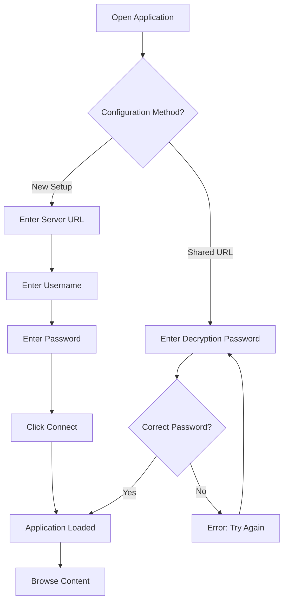
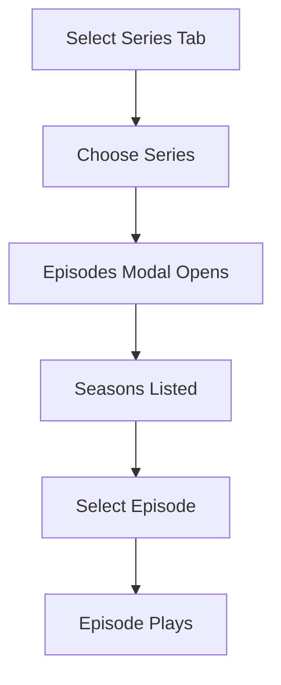
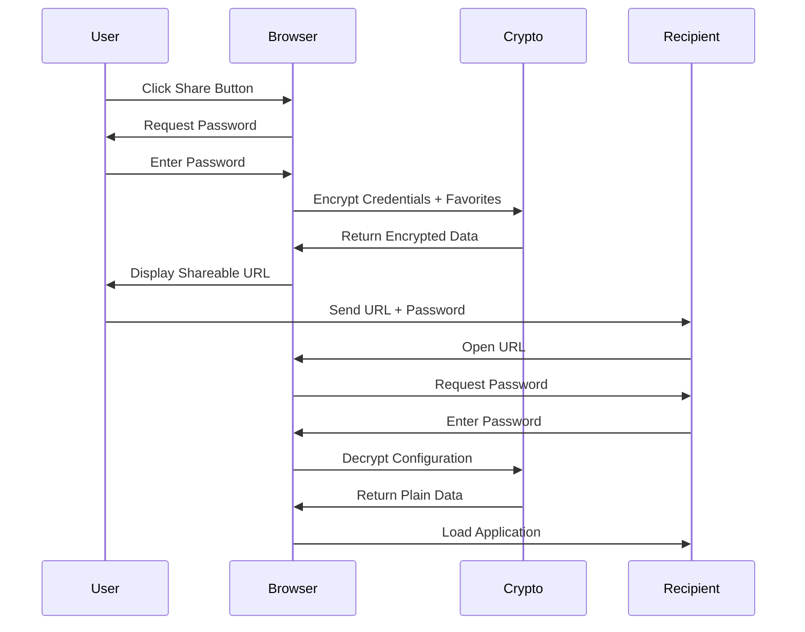
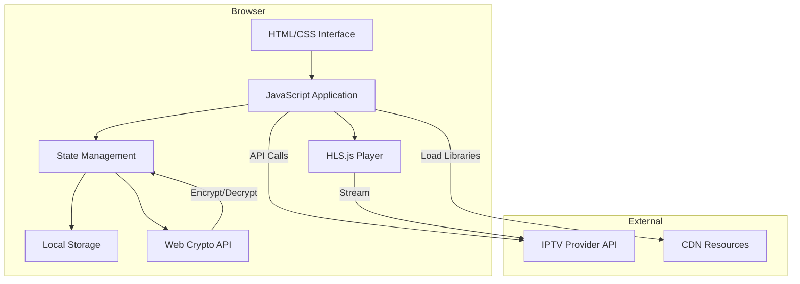

# xsukax IPTV Player

A secure, browser-based IPTV streaming application optimized for Chrome and Edge browsers, featuring client-side encryption and zero-server data storage for maximum privacy.

[](https://xsukax.github.io/xsukax-IPTV-Player)
[](LICENSE)
[](https://github.com/xsukax/xsukax-IPTV-Player)

## 🎯 Project Overview

xsukax IPTV Player is a lightweight, single-page web application designed to provide seamless access to IPTV content through Xtream Codes API-compatible servers. Built entirely with vanilla JavaScript and requiring no backend infrastructure, this player runs completely in the user's browser, ensuring privacy and eliminating dependency on external servers for credential storage or processing.

The application supports live TV streaming, video-on-demand (VOD) movies, and TV series with full episode management, all accessible through an intuitive, modern interface built with Tailwind CSS.

**Demo:** [https://xsukax.github.io/xsukax-IPTV-Player](https://xsukax.github.io/xsukax-IPTV-Player)

## 🔒 Security and Privacy Benefits

### Client-Side Encryption
All sensitive credentials are encrypted using **AES-256-GCM encryption** with PBKDF2 key derivation (100,000 iterations) directly in the browser. When generating shareable configuration URLs, your server credentials and favorites are encrypted locally before being encoded into the URL, ensuring that no plaintext data is ever transmitted or stored on any server.

### Zero Data Collection
The application operates entirely client-side with no backend infrastructure. This means:
- **No server-side storage**: Your IPTV credentials are never sent to or stored on any external server
- **No tracking**: No analytics, cookies, or tracking mechanisms are implemented
- **No user accounts**: Authentication happens directly with your IPTV provider's API
- **Local storage only**: Favorites are stored exclusively in your browser's localStorage

### Secure Sharing Mechanism
The shareable URL feature employs cryptographic best practices:
- User-defined passwords protect encrypted configurations
- Salt and initialization vectors are randomly generated for each encryption operation
- Encrypted data is base64-encoded and embedded in the URL parameter
- Decryption occurs entirely in the recipient's browser without any intermediary

### Browser Security Standards
Built on modern Web Crypto API standards, the application leverages native browser cryptography implementations that are continuously maintained and audited by browser vendors, providing robust protection against common web vulnerabilities.

## ✨ Features and Advantages

### Core Capabilities
- **Multi-Format Support**: Seamlessly handles HLS (.m3u8) streams and direct video files (MP4, MKV, etc.)
- **Comprehensive Content Access**: Browse and stream live TV channels, movies, and TV series with full episode navigation
- **Advanced Organization**: Category filtering, real-time search, and lazy loading for efficient content browsing
- **Favorites System**: Save and quickly access your preferred channels and content across sessions
- **Responsive Design**: Fully functional on desktop and mobile devices with touch-optimized controls

### Performance Optimizations
- **Intelligent Caching**: API responses are cached to minimize redundant network requests and improve load times
- **Lazy Loading**: Content loads progressively with "Load More" functionality to handle large channel lists efficiently
- **HLS.js Integration**: Leverages adaptive bitrate streaming for optimal playback quality based on network conditions

### User Experience
- **Clean GitHub-Inspired UI**: Modern, minimalist interface with professional styling and smooth animations
- **Skeleton Loading**: Visual feedback during data fetching enhances perceived performance
- **Real-Time Notifications**: Toast notifications provide immediate feedback for all user actions
- **Keyboard Accessible**: Full keyboard navigation support for accessibility compliance

### Privacy-First Design
- **No Registration Required**: Connect directly to your IPTV provider without creating additional accounts
- **Offline Configuration**: Once loaded, the application can cache content for reduced subsequent load times
- **Browser-Only Operation**: Complete functionality without requiring any server-side components or databases

## 📥 Installation Instructions

### Option 1: GitHub Pages (Recommended)
Access the application directly through the hosted demo:

```
https://xsukax.github.io/xsukax-IPTV-Player
```

No installation required. Simply bookmark the URL for future access.

### Option 2: Local Deployment
Clone the repository and serve the HTML file:

```bash
# Clone the repository
git clone https://github.com/xsukax/xsukax-IPTV-Player.git

# Navigate to the directory
cd xsukax-IPTV-Player

# Serve using Python's built-in HTTP server
python3 -m http.server 8080

# Or using Node.js http-server
npx http-server -p 8080
```

Access the application at `http://localhost:8080`

### Option 3: Direct File Access
For immediate use without any server:

1. Download `index.html` from the repository
2. Open the file directly in Chrome or Edge browser
3. All functionality works without a web server

### Browser Requirements
- **Chrome**: Version 90 or higher
- **Edge**: Version 90 or higher (Chromium-based)
- **Required Features**: Web Crypto API, HLS.js support, ES6+ JavaScript

### CDN Dependencies
The application automatically loads these libraries from CDNs:
- Tailwind CSS (styling framework)
- HLS.js (adaptive streaming support)

Ensure internet connectivity for initial load to fetch CDN resources.

## 📖 Usage Guide

### Initial Setup



### Connecting to Your IPTV Provider

1. **Launch the Application**: Open the application URL in Chrome or Edge
2. **Enter Credentials**:
   - **Server URL**: Your IPTV provider's API endpoint (e.g., `http://example.com:8080`)
   - **Username**: Your IPTV account username
   - **Password**: Your IPTV account password
3. **Connect**: Click the "Connect" button to authenticate
4. **Success**: Upon successful authentication, you'll see the main interface with available content

### Browsing and Playing Content

#### Live TV Channels


1. Click the **📺 Live TV** tab in the navigation bar
2. Select a category from the dropdown menu or keep "All Categories" selected
3. Use the search box to filter channels by name
4. Click any channel card to begin streaming
5. Video player controls appear automatically with channel information overlay

#### Movies
1. Click the **🎬 Movies** tab
2. Browse or search for movies by title
3. Click a movie card to start playback
4. The player loads with full video controls

#### TV Series


1. Click the **📺 Series** tab
2. Select a TV series from the list
3. A modal displays all seasons and episodes
4. Click any episode to begin streaming
5. Navigate between episodes seamlessly

### Managing Favorites

- **Add to Favorites**: Click the star icon (☆) next to any channel, movie, or series
- **Remove from Favorites**: Click the filled star icon (★) to remove
- **View All Favorites**: Click the "Favorites" button in the header to see your saved content
- **Persistence**: Favorites are stored in browser localStorage and persist across sessions

### Sharing Configuration



1. **Generate Share URL**:
   - Click the "Share" button in the header
   - Enter a strong password (minimum 4 characters)
   - Click "Generate URL"
   - Copy the generated URL

2. **Share Securely**:
   - Send the URL to the recipient through one channel (e.g., email)
   - Send the password through a different secure channel (e.g., messaging app)
   - Never send both URL and password together in the same message

3. **Recipient Access**:
   - Open the shared URL in their browser
   - Enter the decryption password when prompted
   - Application loads with shared configuration

### Keyboard Shortcuts and Accessibility

- **Tab Navigation**: Move between interface elements
- **Enter/Space**: Activate buttons and select channels
- **Arrow Keys**: Navigate within lists and categories
- **Search Box Focus**: Type immediately after page load
- **Video Controls**: Standard HTML5 video keyboard controls (Space for play/pause, arrows for seeking)

### Application Architecture



### Troubleshooting

**Playback Issues:**
- Ensure your browser supports HLS.js (Chrome/Edge recommended)
- Check network connectivity to IPTV provider
- Verify credentials are correct
- Try refreshing the page if streams fail to load

**Shared URL Problems:**
- Confirm password matches exactly (case-sensitive)
- Verify URL wasn't truncated when copying
- Check that recipient uses Chrome or Edge browser

**Performance:**
- Clear browser cache if experiencing slowdowns
- Reduce concurrent streams if bandwidth is limited
- Close unnecessary browser tabs to free memory

## 📄 License

This project is licensed under the GNU General Public License v3.0.

---

**Disclaimer**: This application is designed to work with legitimate IPTV services that you have authorized access to. Users are responsible for ensuring they have proper rights and permissions to access any content through their IPTV provider. The developers of this application do not provide, host, or distribute any IPTV content or services.

**Repository**: [https://github.com/xsukax/xsukax-IPTV-Player](https://github.com/xsukax/xsukax-IPTV-Player)

**Issues and Support**: For bug reports or feature requests, please open an issue on GitHub.
