# xsukax IPTV Player

A lightweight, secure, and privacy-focused IPTV player that runs entirely in your browser. Stream live TV, movies, and series from your IPTV provider with zero server-side processing—your credentials never leave your device.

[](http://iptv.xsukax.net)
[](LICENSE)
[](https://html.spec.whatwg.org/)
[](https://developer.mozilla.org/en-US/docs/Web/JavaScript)

## 🌟 Project Overview

**xsukax IPTV Player** is a single-file HTML application designed for streaming IPTV content directly in modern web browsers. Unlike traditional IPTV players that require backend servers or desktop installations, this player operates entirely client-side using vanilla JavaScript and HLS.js for adaptive streaming. It supports live TV channels, video-on-demand (VOD) movies, and episodic series content from Xtream Codes API-compatible IPTV providers.

The application emphasizes user privacy, security, and portability. All authentication credentials and user data are processed locally in the browser—no data is transmitted to third-party servers. Users can download the single `index.html` file and run it offline or host it on any web server without requiring additional dependencies or backend infrastructure.

### Key Capabilities
- **Universal Compatibility**: Works with any IPTV service using the Xtream Codes API protocol
- **Multi-Format Streaming**: Supports HLS (`.m3u8`) and direct video formats (`.mp4`, `.mkv`, etc.)
- **Responsive Design**: Optimized for desktop and mobile browsers with adaptive layouts
- **Offline Capability**: Download and run locally without internet connectivity (except for streaming)
- **Zero Installation**: No plugins, extensions, or additional software required

## 🔒 Security and Privacy Benefits

This application implements multiple layers of security and privacy protection to ensure your sensitive data remains confidential:

### Client-Side Architecture
All operations execute within your browser's sandbox environment. Your IPTV credentials (server URL, username, password) are never transmitted to any external server except your chosen IPTV provider. There is no analytics tracking, no telemetry, and no third-party data collection.

### Encrypted Configuration Sharing
The shareable URL feature allows you to share your IPTV configuration with trusted devices or users while maintaining security:

- **AES-256-GCM Encryption (HTTPS/Localhost)**: When accessed via HTTPS or localhost, the application uses industry-standard AES-256-GCM encryption with PBKDF2 key derivation (100,000 iterations). Your credentials are cryptographically protected with a user-defined password, ensuring that even if the URL is intercepted, the data remains unreadable without the decryption key.

- **Base64 Encoding (HTTP Fallback)**: When accessed via HTTP or the `file://` protocol (where Web Crypto API is unavailable), the application falls back to Base64 encoding with password verification. While not cryptographically secure, this prevents casual exposure of credentials and maintains functionality across all environments.

**Important**: Shareable URLs should only be transmitted through secure channels (encrypted messaging, password managers) and passwords should never be shared in the same message as the URL.

### Local Data Storage
Favorites and preferences are stored exclusively in your browser's `localStorage`. This data persists across sessions but remains isolated to your device and cannot be accessed by other websites or applications due to browser same-origin policies.

### No External Dependencies
The application loads only one external library (HLS.js from jsDelivr CDN) for adaptive streaming functionality. No tracking scripts, advertising networks, or analytics frameworks are included. All styling and logic are embedded within the single HTML file.

### Credential Protection
- Passwords are never logged to the browser console
- No credential caching on the server side (because there is no server)
- Automatic logout functionality clears sensitive data from memory
- HTTPS enforcement recommended for production deployments

## ✨ Features and Advantages

### Core Functionality
- **📺 Live TV Streaming**: Browse and watch live television channels with category filtering
- **🎬 Video on Demand**: Access your provider's movie library with metadata and thumbnails
- **📺 Series Support**: Watch episodic content organized by seasons and episodes
- **⭐ Favorites Management**: Mark content as favorites for quick access across sessions
- **🔍 Real-Time Search**: Instant filtering of channels/content by name
- **📱 Responsive UI**: Clean, GitHub-inspired interface that adapts to any screen size

### Technical Advantages
- **Single-File Deployment**: The entire application is contained in one `index.html` file—no build process, no dependencies to manage
- **HLS Adaptive Streaming**: Automatic quality adjustment based on network conditions using HLS.js
- **Lazy Loading**: Channels load progressively in batches of 50 for optimal performance
- **Smart Caching**: API responses are cached in memory to minimize network requests
- **Cross-Platform**: Works on Windows, macOS, Linux, Android, and iOS browsers

### User Experience
- **Subscription Info Display**: View account expiration dates and status at a glance
- **Category Organization**: Content organized by provider-defined categories
- **Episode Metadata**: Detailed episode information including titles and numbering
- **Skeleton Loaders**: Visual feedback during content loading for better perceived performance
- **Toast Notifications**: Non-intrusive success/error messages for user actions

### Privacy-Focused Design
- **No Registration**: Use the player immediately without creating accounts
- **No Tracking**: Zero analytics, cookies, or user behavior monitoring
- **Open Source**: Complete transparency—audit the code yourself
- **Data Portability**: Export/import configurations via shareable URLs

## 📦 Installation Instructions

### Method 1: Direct Download (Recommended for HTTP IPTV Servers)

1. **Download the Application**
   ```bash
   git clone https://github.com/xsukax/xsukax-IPTV-Player.git
   cd xsukax-IPTV-Player
   ```
   Alternatively, download `index.html` directly from the [GitHub repository](https://github.com/xsukax/xsukax-IPTV-Player).

2. **Open Locally**
   - Double-click `index.html` to open in your default browser
   - Or right-click → Open With → Choose your preferred browser (Chrome, Edge, Firefox)

3. **Why Local?**
   If your IPTV provider uses HTTP (not HTTPS) URLs, browsers will block mixed content when accessing from an HTTPS website. Running locally bypasses this restriction.

### Method 2: Web Hosting (For HTTPS IPTV Servers)

1. **Upload to Web Server**
   - Upload `index.html` to any web hosting service (GitHub Pages, Netlify, Vercel, etc.)
   - Ensure HTTPS is enabled for full encryption functionality
   - No server-side processing required—static hosting is sufficient

2. **Access via Browser**
   - Navigate to your hosted URL
   - Add to browser bookmarks for quick access

### Method 3: Try the Demo

Visit the live demo at [http://iptv.xsukax.net](http://iptv.xsukax.net) to test the player without installation.

**Note**: The demo uses HTTP (not HTTPS) to ensure compatibility with HTTP-based IPTV servers. Many IPTV providers still use HTTP endpoints, which browsers block when accessed from HTTPS pages due to mixed content security policies. For personal use with HTTPS IPTV servers, host the file yourself with SSL enabled.

### Browser Compatibility

| Browser | Minimum Version | Notes |
|---------|----------------|-------|
| Chrome | 87+ | ✅ Recommended |
| Edge | 87+ | ✅ Recommended |
| Firefox | 78+ | ✅ Supported |
| Safari | 14+ | ⚠️ Limited HLS support |
| Opera | 73+ | ✅ Supported |

## 📖 Usage Guide

### Initial Setup


1. **Launch the Application**
   - Open `index.html` in a supported browser
   - The login modal will appear automatically

2. **Enter IPTV Credentials**
   - **Server URL**: Your provider's server address (e.g., `http://example.com:8080`)
     - Remove trailing slashes
     - Include the port number if required
   - **Username**: Your account username
   - **Password**: Your account password

3. **Connect**
   - Click "Connect" to authenticate
   - The application validates credentials with your IPTV provider
   - Upon success, you'll see your subscription status and available content

### Navigation and Content Discovery

```mermaid
graph TD
    A[Main Interface] --> B[Content Tabs]
    B --> C[📺 Live TV]
    B --> D[🎬 Movies]
    B --> E[📺 Series]
    
    C --> F[Category Filter]
    D --> F
    E --> F
    
    F --> G[Search Bar]
    G --> H[Channel List]
    H --> I{Content Type}
    
    I -->|Live/Movie| J[Play Stream]
    I -->|Series| K[Episode Selector]
    K --> J
```



**Content Tabs**
- **📺 Live TV**: Browse live television channels by category
- **🎬 Movies**: Access your provider's VOD movie collection
- **📺 Series**: Watch episodic content organized by show and season

**Filtering and Search**
- **Category Dropdown**: Filter content by provider-defined categories
- **Search Bar**: Type to instantly filter results by name
- **Favorites Button**: Quick access to your marked favorites

### Playing Content

**For Live TV and Movies:**
1. Click any channel/movie in the list
2. The video player loads automatically
3. Use standard video controls (play/pause, volume, fullscreen)

**For Series:**
1. Click a series to open the episode browser
2. Episodes are organized by season
3. Click any episode to start playback
4. The modal closes automatically when playing

### Managing Favorites

```mermaid
sequenceDiagram
    participant U as User
    participant B as Browser
    participant L as LocalStorage
    
    U->>B: Click ⭐ Star Icon
    B->>B: Toggle Favorite Status
    B->>L: Save to localStorage
    L-->>B: Confirm Storage
    B->>U: Show Toast Notification
    B->>B: Update UI (★/☆)
```



- Click the **star icon (☆/★)** on any channel to add/remove favorites
- Access all favorites via the **"Favorites"** button in the header
- Favorites persist across browser sessions using localStorage
- The favorite count badge updates in real-time

### Sharing Configurations

The shareable URL feature enables secure transfer of your IPTV configuration to other devices or trusted users.


**Generating a Shareable URL:**

1. Click the **"Share"** button in the header
2. Enter a strong password (minimum 4 characters, 12+ recommended)
3. Click **"Generate URL"**
4. The application creates a URL containing your encrypted credentials

**Encryption Methods:**
- **HTTPS/Localhost**: Full AES-256-GCM encryption with PBKDF2 key derivation (100,000 iterations)
- **HTTP/File Protocol**: Base64 encoding with password verification (notification displayed)

5. **Copy URL**: Use the "Copy URL" button to copy to clipboard
6. **Test URL**: Opens the URL in a new tab to verify functionality
7. **Share Securely**: Transmit the URL and password through separate, secure channels

**Using a Shared URL:**

1. Open the provided URL in your browser
2. The password prompt appears automatically
3. Enter the password provided separately
4. The application decrypts/decodes and logs in automatically
5. Your favorites are also restored from the shared configuration

**Security Best Practices:**
- Never share the URL and password in the same message
- Use strong, unique passwords for each shared configuration
- Share only with trusted recipients
- Consider password managers for secure storage
- URLs expire when credentials change—regenerate as needed

### Account Information

The header displays real-time subscription details:
- **👤 Username**: Your IPTV account username
- **📅 Expiry Status**:
  - 🟢 Valid until [date] (green badge)
  - 🟡 Expires in X days (yellow warning)
  - 🔴 Expired (red alert)
  - ♾️ Lifetime subscription indicator

### Logging Out

Click the **"Logout"** button to:
- Clear all cached data from memory
- Stop active streams
- Return to the login screen
- Preserve favorites in localStorage (they're device-specific)

## 🎨 Customization

While the application works perfectly out-of-the-box, developers can customize the appearance by modifying the embedded CSS within `index.html`. The design uses a GitHub-inspired color scheme with CSS variables for easy theming.

## 🐛 Troubleshooting

| Issue | Solution |
|-------|----------|
| **Connection Failed** | Verify server URL format, check credentials, ensure server is online |
| **Mixed Content Blocked** | Use HTTP demo or host on HTTP server for HTTP IPTV servers |
| **Video Won't Play** | Check browser compatibility, try a different browser, verify stream URL |
| **Favorites Not Saving** | Ensure browser allows localStorage, check privacy settings |
| **Slow Loading** | Normal for large channel lists—pagination loads 50 items at a time |

## 🤝 Contributing

Contributions are welcome! Please feel free to submit issues or pull requests to improve the player.

## 📄 License

This project is licensed under the GNU General Public License v3.0.

---

**Developed with ❤️ for the IPTV community** | [Report Issues](https://github.com/xsukax/xsukax-IPTV-Player/issues) | [Demo](http://iptv.xsukax.net)
